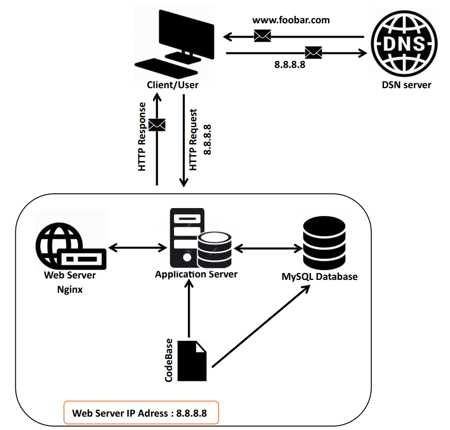

# Simple Web Stack

## Definitions and Explanations
--What a server is:
A server is a computer or system that is designed to manage network resources and provide services to other computers, known as clients, in the same network.

--What is the role of the domain name:
A domain name plays a crucial role in the context of the internet and online services. It serves as a user-friendly way to identify and access resources, such as websites or email servers, on the internet.

--What type of DNS record www is in www.foobar.com:
The "www" in a domain like "www.foobar.com" is typically a subdomain, and it is represented by a DNS record known as a "CNAME" (Canonical Name) record. The purpose of a CNAME record is to alias one domain to another. In the case of "www.foobar.com," the CNAME record would point to the main domain, "foobar.com," or it might point to another domain where the website content is hosted.

--What is the role of the web server:
A web server plays a critical role in serving and delivering web content to users over the internet. Its primary function is to handle requests from clients (typically web browsers) and respond by delivering the requested web pages, files, or resources.

--What is the role of the application server:
An application server is a software framework that provides an environment for running and managing applications. Its primary role is to host and execute applications, handle business logic, and facilitate communication between the application and other components, such as databases and web servers.

--What is the role of the database:
A database plays a crucial role in storing, managing, and organizing data in a structured manner. It acts as a central repository that allows efficient retrieval, manipulation, and storage of information.

--What is the server using to communicate with the computer of the user requesting the website:
When a user requests a website, the communication between the user's computer and the server is facilitated through the Hypertext Transfer Protocol (HTTP) or its secure counterpart, HTTPS (HTTP Secure). These protocols define how information is transmitted over the internet.

## Issues With This Infrastructure
--Single Point of Failure (SPOF):
A Single Point of Failure (SPOF) means that there is a critical component in the infrastructure, such as a server or network device, that, if it fails, can cause the entire system to become unavailable. In the context of the described infrastructure, if there is only one web server, and it goes down for any reason (hardware failure, software issue, etc.), the entire website or application becomes inaccessible. To mitigate SPOF, redundancy and failover mechanisms can be implemented, such as having multiple servers and load balancers.

--Downtime when maintenance is needed (like deploying a new code web server
needs to be restarted):
When maintenance tasks, such as deploying new code or updates, are needed, it often requires restarting the web server. During this period, the website or application may experience downtime, leading to a temporary loss of service for users. This can impact user experience and may not be acceptable for applications requiring high availability. Implementing strategies like rolling deployments or having redundant servers can help minimize downtime during maintenance.

--Cannot scale if there's too much incoming traffic:
The described infrastructure may face scalability challenges, especially when dealing with a sudden increase in incoming traffic. If the demand surpasses the capacity of a single server, the system may struggle to handle the load efficiently. Scaling horizontally by adding more servers or implementing load balancing can help distribute the traffic and scale the infrastructure to meet increased demand.
