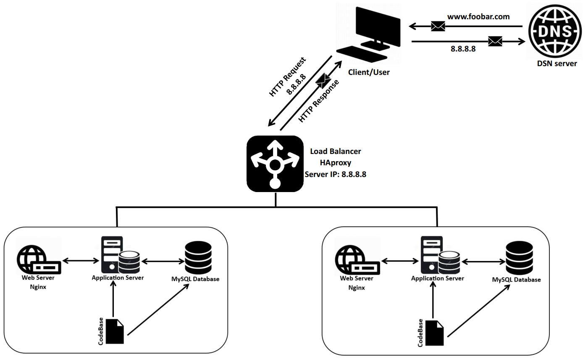

# Distributed Web Infrastructure

## Definitions and Explanations:
--For every additional element, why you are adding it:
Adding a new server so that we can
be able to add a load balancer to handle too much incoming traffic and also enable us to
eliminate a single point of failure which could occur by having just one server.

--What distribution algorithm your load balancer is configured with and how it works:
The choice of the Round Robin algorithm in this context is based on its simplicity and the assumption that servers have similar capacities. However, in a real-world scenario, consideration should be given to the specific requirements of the application, server capacities, and the desired distribution characteristics. If server capacities vary significantly, alternatives like Weighted Round Robin or Least Connections may be more appropriate.

--Is your load-balancer enabling an Active-Active or Active-Passive setup, explain the difference between both:
In an Active-Active setup, all servers are actively engaged in processing requests, providing better performance and fault tolerance. This is advantageous for scenarios where optimal performance and even load distribution are essential.
On the other hand, an Active-Passive setup designates specific servers as active and others as passive, with the passive servers only becoming active in the event of a failure. This is more cost-effective in terms of resource utilization but may lead to underutilization during periods of normal operation.
The choice between Active-Active and Active-Passive depends on the specific requirements of the application, the desired level of performance, and the trade-offs between resource usage and redundancy.

--How a database Primary-Replica (Master-Slave) cluster works:
A Primary-Replica (Master-Slave) database cluster is a configuration where there is one primary node (master) and one or more replica nodes (slaves). This setup is commonly used for improving database performance, scalability, and fault tolerance.

--What is the difference between the Primary node and the Replica node in regard to the application:
The primary node is the authoritative source for write operations and ensures data consistency, while replica nodes primarily handle read operations, providing scalability, load balancing, and fault tolerance for read-heavy workloads. Applications need to be aware of these roles and interact with the appropriate nodes based on the type of operation being performed.

## Issues with this infrastructure:
--Where are SPOF:
In the proposed infrastructure, there are potential Single Points of Failure (SPOFs) that could impact the overall availability and reliability of the system. Identifying and addressing SPOFs is crucial for designing a robust and fault-tolerant architecture.
Addressing these potential SPOFs involves implementing redundancy, fault-tolerant configurations, and security measures. Redundancy is particularly critical for components like load balancers and database nodes to ensure continuous operation in the face of failures. The goal is to design an infrastructure that minimizes the impact of failures on the overall system and provides a high level of availability and reliability.

--Security issues (no firewall, no HTTPS):
In the proposed infrastructure, there are notable security issues that need attention.
Major security issues involve having the
application communicate over HTTP protocol that is not secure and can allow an attacker
(who may be in the middle) to view sensitive information (since HTTP transfers plain
texts) like passwords. Also since the application doesn’t have a firewall, This can allow
an attacker to perform a denial of service attack(DOS or DDOS) that may cause a major
downtime in the system, or allow a malicious attacker to breach the system exploiting
unknown open ports and perform data exfiltration.
addressing these security issues involves implementing encryption through HTTPS, establishing a robust firewall configuration, and implementing measures to mitigate the risks associated with DoS/DDoS attacks and the exploitation of open ports. Regular security assessments and monitoring are essential to maintaining a resilient and secure infrastructure.

--No monitoring:
The absence of monitoring in an infrastructure introduces significant security and operational risks. Monitoring is a critical component of maintaining the health, performance, and security of systems. Here are the key implications and recommended mitigations for the lack of monitoring.
By implementing a robust monitoring strategy, organizations can proactively identify and address issues, enhance security, optimize resource usage, and improve overall system reliability. Monitoring is an essential part of a proactive and effective IT management and security strategy.
