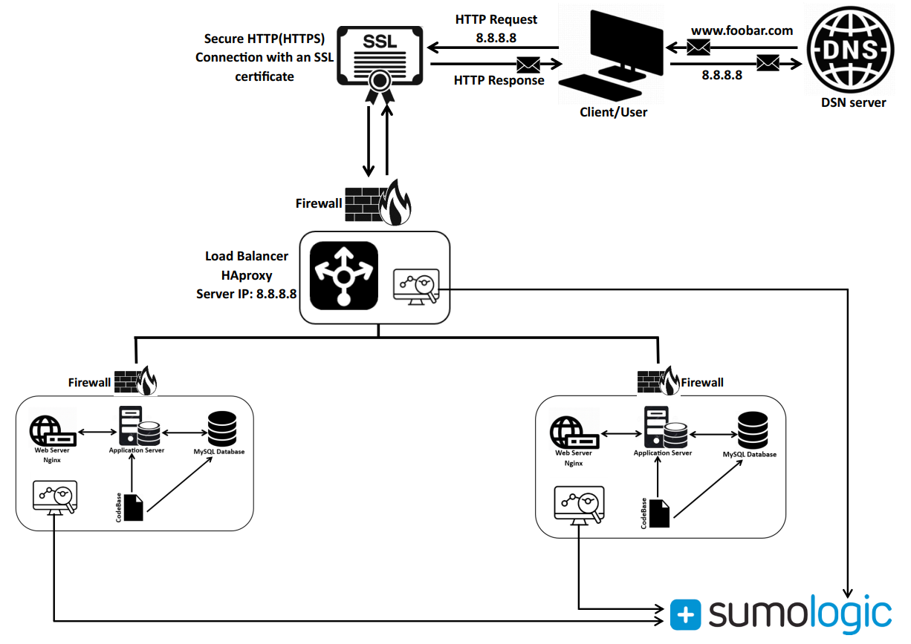

# Secured and Monitored Web Infrastructure:

## Definitions and Explanations:
--For every additional element, why you are adding it:
The designed three-server web infrastructure for www.foobar.com incorporates various elements to ensure security, reliability, and optimal performance. The inclusion of load balancers, multiple web and application servers, database servers with replication, firewalls, SSL certificates, and monitoring clients contributes to a robust and scalable architecture.
The load balancer enhances availability and scalability by distributing incoming traffic, preventing server overload. Multiple web and application servers improve fault tolerance and distribute the load efficiently, providing a seamless user experience. Database servers with replication ensure data redundancy and availability, minimizing the risk of a single point of failure.

--What are firewalls for:
Firewalls serve as a critical component of network security, acting as a barrier between a trusted internal network and untrusted external networks, such as the internet.
firewalls act as a first line of defense against cyber threats, providing a crucial layer of protection for networks by controlling and monitoring traffic, preventing unauthorized access, and enhancing overall security.

--Why is the traffic served over HTTPS:
Serving traffic over HTTPS (Hypertext Transfer Protocol Secure) is crucial for several reasons, primarily focused on ensuring the security and privacy of data transmitted between a user's browser and the web server.
serving traffic over HTTPS is a fundamental practice for securing online communications, protecting user privacy, building trust, and meeting regulatory requirements. It has become a standard best practice for any website that handles sensitive information or aims to provide a secure and trustworthy user experience.

--What monitoring is used for
Monitoring is a critical aspect of managing and maintaining the health, performance, and security of IT systems, networks, and applications.
Monitoring is a proactive and strategic practice that enhances the overall management, performance, security, and reliability of IT systems. By continuously collecting and analyzing data, organizations can make informed decisions, prevent disruptions, and deliver a seamless and secure user experience.

--How the monitoring tool is collecting data:
Monitoring tools collect data through various mechanisms, utilizing agents, sensors, or other methods to gather information from different components of the IT infrastructure. The exact approach depends on the type of monitoring tool and the specific metrics being measured.
Monitoring tools often employ a combination of these methods to comprehensively capture data from diverse components of the IT infrastructure. The chosen approach depends on the specific monitoring requirements, the nature of the systems being monitored, and considerations such as security and resource impact.

--Explain what to do if you want to monitor your web server QPS:
To monitor the Query Per Second (QPS) of your web server, you can follow these general steps:

Define Metrics:
Identify the specific metrics related to QPS that you want to monitor. This might include the total number of queries, requests per second, response times, or error rates.
Select a Monitoring Tool:
Choose a monitoring tool that supports the collection and visualization of the QPS metrics. Popular monitoring tools include Prometheus, Grafana, Nagios, Zabbix, and many cloud-based solutions like AWS CloudWatch or Google Cloud Monitoring.
Install Monitoring Agents (if required):
Depending on the chosen monitoring tool, you may need to install monitoring agents on your web server. Some tools, especially those using an agent-based approach, require a lightweight software component on each monitored server.
Configure Monitoring Tool:
Configure the monitoring tool to collect QPS-related metrics. This involves specifying the data sources (e.g., web server logs, performance counters), setting up data collection intervals, and defining alert thresholds if necessary.
Integrate with Web Server Logs:
If monitoring QPS through web server logs, ensure that the logging feature is enabled on your web server. Configure the monitoring tool to parse and analyze the logs to extract relevant QPS-related information.
Instrumentation and APIs:
For more detailed and application-specific metrics, consider instrumenting your web server code or utilizing APIs provided by the web server software. This may require adding code snippets or plugins to your application to expose QPS-related data.
Visualize Metrics:
Use the monitoring tool's dashboard or visualization features to create charts and graphs that represent QPS over time. This visualization helps in quickly identifying trends, patterns, and potential issues.
Set Up Alerts:
Configure alerts based on QPS thresholds to be notified when the QPS exceeds predefined limits or when anomalies are detected. Alerts ensure a timely response to potential performance issues.
Historical Analysis:
Utilize historical data and trend analysis to understand the typical QPS patterns during different periods. This information is valuable for capacity planning and optimizing resource allocation.
Periodic Review and Adjustment:
Regularly review the monitoring setup, including the metrics being collected and alert configurations. Adjust thresholds and add or modify metrics as needed to align with changing business requirements.
Documentation:
Document the monitoring setup, including the selected metrics, configuration settings, and procedures for interpreting the data. This documentation is valuable for onboarding new team members and ensuring consistency in monitoring practices.
By following these steps, you can effectively monitor the QPS of your web server, enabling proactive management, performance optimization, and timely response to potential issues. The choice of monitoring tools and specific configurations will depend on your organization's preferences, infrastructure, and requirements.

## Issues with this infrastructure:
--Why terminating SSL at the load balancer level is an issue:
Terminating SSL (Secure Sockets Layer) at the load balancer level has both advantages and disadvantages. 
It's important to note that while terminating SSL at the load balancer has these potential issues, there are situations where it makes sense, especially when the backend servers do not require access to the original encrypted traffic, or when offloading SSL processing at the load balancer provides performance benefits. The decision should be based on a careful consideration of the specific requirements and trade-offs for a given application and infrastructure.

--Why having only one MySQL server capable of accepting writes is an issue:
because once it is down it means do data can be added or updated meaning some
features of the application won’t work.

--Why having servers with all the same components (database, web server and application server) might be a problem:
Having servers with identical components across the entire infrastructure, including the database, web server, and application server, can introduce several potential problems.
