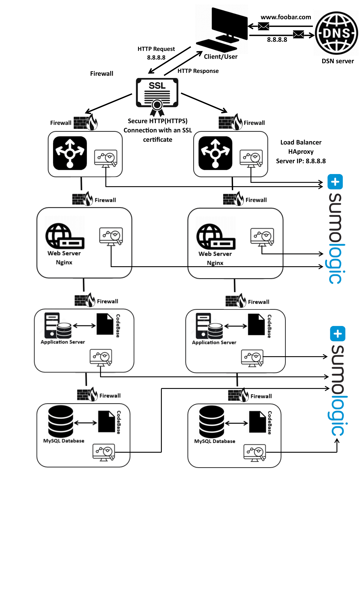

# Scaled Up Web Infrastructure

## Explanations About This Infrastructure:
The addition of a firewall between each server.
This protects each server from unwanted and unauthorized users rather than protecting a single server.

## Issues:
Escalating maintenance expenses arise when distributing each major component to individual servers, necessitating the acquisition of additional servers. This, in turn, results in an augmented electricity bill for the company due to the increased server count. Allocation of company funds becomes imperative for procuring these servers and covering the escalating electricity consumption required to sustain both the existing and newly introduced servers.
